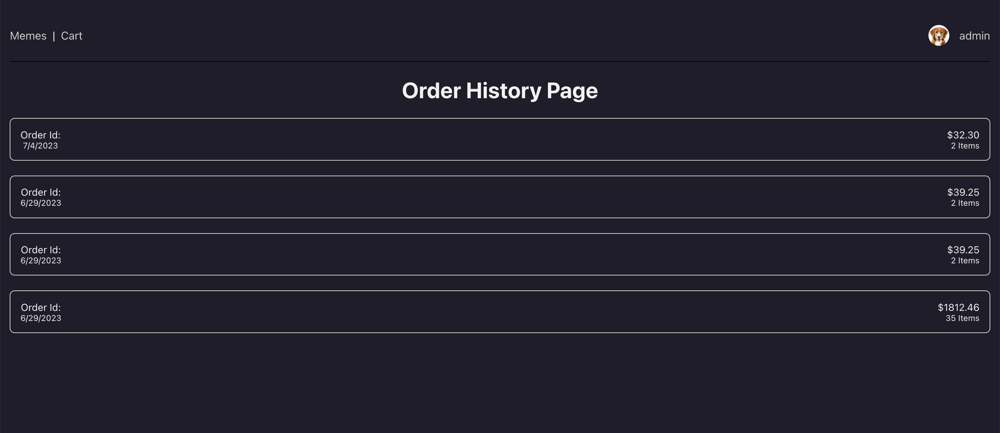

# App Title: MemeShop
## An online store for cat memes
# Screenshot(s): 
  
  

# Technologies Used: 
- MongoDB
- Express
- React
- NodeJS  
  
# Getting Started: That Includes:
[Trello](https://trello.com/b/k6WjUyig/project-4-memestore)

# Next Steps: 
Planned future enhancements (icebox items).
Download a PDF to certify you bought a meme with real-world money, and own a ~~the meme~~ a certificate that says you own the meme.